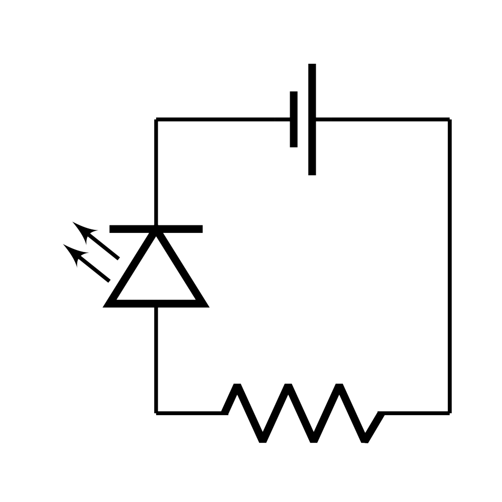

# Silicon

### A simple CircuiTiKZ schematic drawing library for Python

Silicon is a library for drawing circuit schematics using CircuiTiKZ in Python.
It is designed to be easy to use and to provide a simple interface for creating
circuit diagrams. CircuiTiKZ is a powerful TiKZ-based LaTeX package that allows
you to draw circuit diagrams in documents. Silicon provides a Python interface
to CircuiTiKZ, allowing you to create diagrams using Python code. Diagrams
generated by Silicon can be used directly in LaTeX documents, as well as
exported to image files.

### Early development

CircuiTiKZ is currently in an early development stage and only a few basic
arbitrarily chosen electronic components are available. There may also be bugs
and issues, as well as some poorly implemented features. Some of the existing
features may also get removed or changed in terms of usage or produced results
in the future.

### System requirements

- Python 3.12+ with the following packages:
    - `tempfile`
    - `Pillow`
    - `matplotlib` - optional, if you want to render schematics in a `pyplot` view
- LaTeX distribution with `pdflatex` command-line interface and the following packages:
    - `circuitikz`
    - `inputenc`
    - `fontenc`
    - `amssymb`
    - `bbold`
    - `textgreek`
    - `geometry`
- The `convert` command-line utility from the `ImageMagick` package, required for exporting images

### Usage

Silicon is not featured in any Python package repository. To use it, you need
to download and put the `silicon` directory in your Python project working
directory, or in a directory of your Python path (`os.path`). To verify that
Silicon is working, you may use one of the scripts provided in the `demo`
directory, or follow this short tutorial.

1. Import everything from the `silicon.components.all` module, as well as
   `ImageRenderer` from the `silicon.render` module.

```python
from silicon.components.all import *
from silicon.render import ImageRenderer
```

2. Create a new schematic using `begin()`. You can specify the scale of the
   schematic. Because the circuit will be rather simple and small, this example
   uses a scale of 3, so the components will be larger than the default size.

```python
schem = begin(scale=3)
```

3. Every electronic component is represented by its own class. Add some
   components to the schematic. This is done by just calling constructors of
   the component classes. The components are always added to the schematic
   created by the most recent `begin()` call. This example uses only
   two-terminal components. Constructors of these components always require
   two arguments, the coordinates of the terminals. There are also more
   parameters, which are all described in the documentation.

```python
# polar components have a positive and a negative terminal
battery = VoltageSource(
    negative=(0, 0),
    positive=(2, 0)
)
# non-polar components have a start and an end terminal
resistor = Resistor(
    start=(2, 2),
    end=(0, 2)
)
# you can also use already defined components to specify locations for new components
diode = LED(
    positive=resistor.end,
    negative=battery.negative
)
```

4. Now add a wire. A wire constructor has a unique syntax, that cannot be
   enforced by the Python language, but has to be followed for the wire to be
   able to be drawn. The constructor accepts any odd number of arguments. Every
   odd argument (counting from 1) must be a point and every even argument must
   be a path specifier. The specifier determines whether the wire section should
   be drawn as a single straight line, or two straight lines parallel to the X
   and Y axes. There can also be a filled circle at the start or end of each
   section. All possible values for path specifiers are defined by the
   `silicon.components.common.PathSpecifier` type alias and are explained in
   detail in the documentation. This example involves the simplest possible
   wire between two points.

```python
# '-' is a path specifier for a single straight line with no circles
Wire(battery.positive, '-', resistor.start)
```

5. The order of adding components, wires and other elements is all up to the
   user. Although keeping them separate or grouped by their function or
   physical location in the schematic can make the code easier to read and
   maintain. When everything is added, the schematic can be drawn. For that,
   create a renderer using the `ImageRenderer` constructor and use its
   `render()` method to redner the schematic. The result will be stored in the
   renderer and will not be displayed or saved anywhere automatically.


```python
renderer = ImageRenderer()
renderer.render(schem)
```

6. The schematic can be displayed using the `show()` method. By default, this
   will open a window with the generated schematic image. Most major Python
   editors can display `pyplot` images within the editor window itself. If you
   wish to display using a `pyplot` view, you may use the `use_pyplot` optional
   keyword argument.

```python
renderer.show(use_pyplot=True)
```

7. If you need LaTeX code of the schematic, instead of using a renderer, you
   may use the following code:

```python
with open('output.tex', 'w') as output:
    schem.render(target=output)
```

Below is the complete code for the example:

```python
from silicon.components.all import *
from silicon.render import ImageRenderer

schem = begin(scale=3)

battery = VoltageSource(
    negative=(0, 0),
    positive=(2, 0)
)
resistor = Resistor(
    start=(2, 2),
    end=(0, 2)
)
diode = LED(
    positive=resistor.end,
    negative=battery.negative
)

Wire(battery.positive, '-', resistor.start)

# Uncomment to generate LaTeX code
# with open('output.tex', 'w') as output:
#     schem.render(target=output)

renderer = ImageRenderer()
renderer.render(schem)
renderer.show(use_pyplot=True)
```

which should produce the following image:



Note that the schematic has a transparent background. If you display it in a
system window and your default image viewer supports transparency, the image
may appear broken. Currently, there are no options to change the background
or store the image file automatically, but you can copy the image from the
window and save it manually.